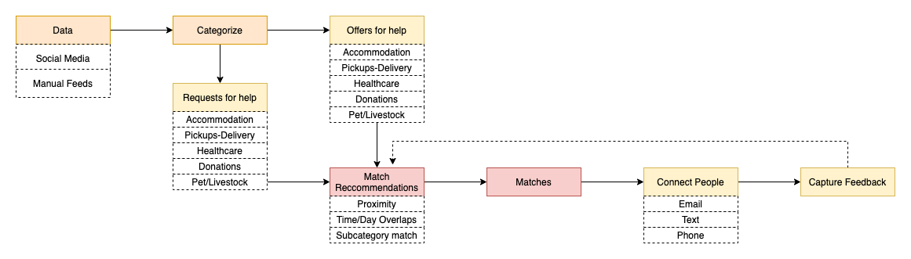
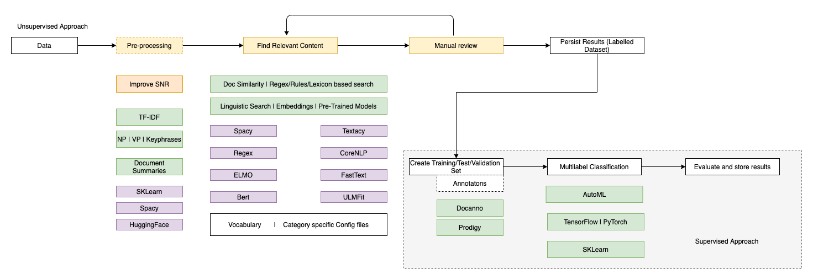

## CrisisApp Marketplace

#### 2nd Apr 2020

### Background

[CrisisApp](https://crisis.app) has a feature which connects two sets of people where one set is a group of people who have the resources(time, money etc.)  to offer help and the other set is a group of people who are in need of help. 

Broadly speaking, there are two 5 categories of help that can be offered/availed. 
- Accommodations/Housing
- Donations eg: household goods, furniture, money
- Health, Medical, First-Aid
- Pet, Livestock, Wildlife boarding accommodation
- Pickup or delivery of groceries, donations, medications

The source of data are webform submissions on the website, social media such as Twitter, Facebook(FB) and News articles. Closed FB groups seem to be the main source of data until the web form submissions become popular enough where the traffic significantly exceeds those that is seen in social media.

### Approach

The general approach would be identify requsets and place them into the right buckets or categories. Once this is done, identify matches based on relevance, proximity of distance and other pre-defined criteria. 

#### Categorizing requests and offers
This applies to requests that don't come through via the Web Forms. Requests and offers coming through in the form of free text(social media, news etc.) need to be categorised. The preferred option to categorise would be to forumalate this problem as a multi-label text classification problem. We can use one of the cloud's AutomL services to create a model and then embed the model into a workflow. 

One of the main dependencies for this approach is the need for labelled datasets. In the absence of labelled datasets, one could manually annotate or label but this can be done if there is already available a decent sized dataset (100s of requests/offers across each cataegory). To circumvent this problem, we can use either of the following techniques:

##### 1. Document Similarity techniques based on sentence representations and word embeddings
These work best if the size of the documents that need to be matched are large enough. Documents which are smaller such as tweets, FB posts may not necessarily be the right candidates. The content(volume) of the documents are rather small when compared to a news article or a blog post. Nevertheless the following techniques were evaluated

- Similarity based on Google's Universal Sentence Encoder 
    - the performance (match quality) is low
    - slower to load the model due to the size of the pre-trained model
    - incompatibilities with the latest version of tensorflow(2.1.z) and tfhub. 
- Sent2Vec based on FastText
    - Match quality is relatively better than the first option
    - Evaluated Sentence embeddings from [EPFML's github repo](https://github.com/epfml/sent2vec)
- Spacy's Similarity based on Word2Vec
    - Match score consistently high for all documents
    - Hard to distinguish between competing documents 

Some of the techniques above can be fine tuned but given time constraints, better off considering a much simpler approach detailed below. 

##### 2. Rule based search and filter

Stanford's CoreNLP and Spacy has features where we can use rule based on linguistic sequence based approach to search and filter content. Since the number of categories defined are a small finite number (5), descriptions for each of these categories are simple enough, this technique proves to be a good starting point. Once sufficient documents have been categorised, we can bootstrap that set as a labelled set to build a multi-label classification model 

Spacy's easy to use library has three main options to experiment with for rule based matching
 - Token Matcher: Flexible, allows regex based matching, matching based on sequence of linguistice patterns (eg: VERB followed by text followed by NOUN)
 - Phrase Matcher: Lexx flexible, cant use regex but set of phrases with limited linguistic patterns 
 - Entity Ruler: This is an option where we can define custom entities which is not required at this point in time

 ### Current Status
 Spacy's Rule based matcher is used based on templates defined to cover two categories - Pickups and Deliveries and Accommodation.

We created a set of seed words for each category. Used Fasttext (Glove vectors) to enrich the vocabulary. Based on the manual inspection of random samples of text from Twitter, specific linguistic patterns were created. 

Tests on sample data is underway at the moment.

### Next Steps
- Create a sufficiently large sample set which can be used as a labelled dataset to build a supervised learning model. 
- Design reccommendation engine to connect the two sets of people 
- Extend our pattern options for engaging with shorter social media based posts

